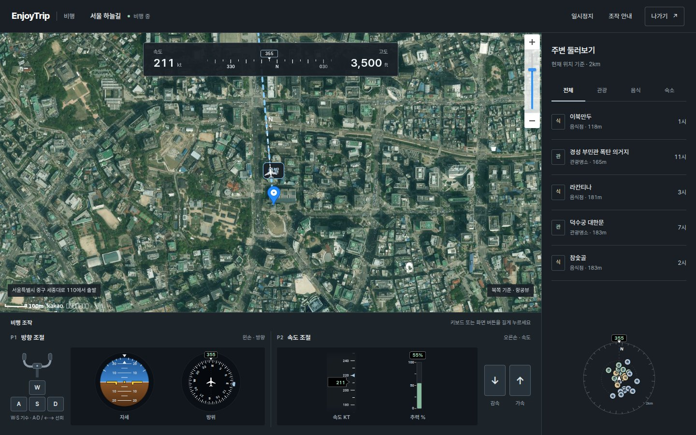
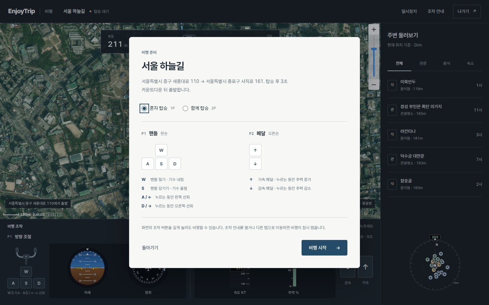
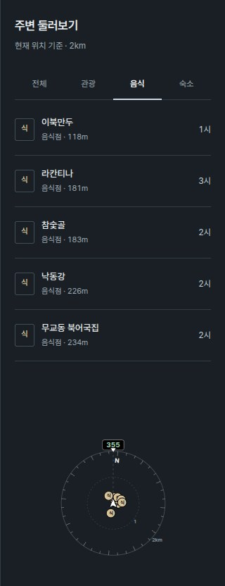
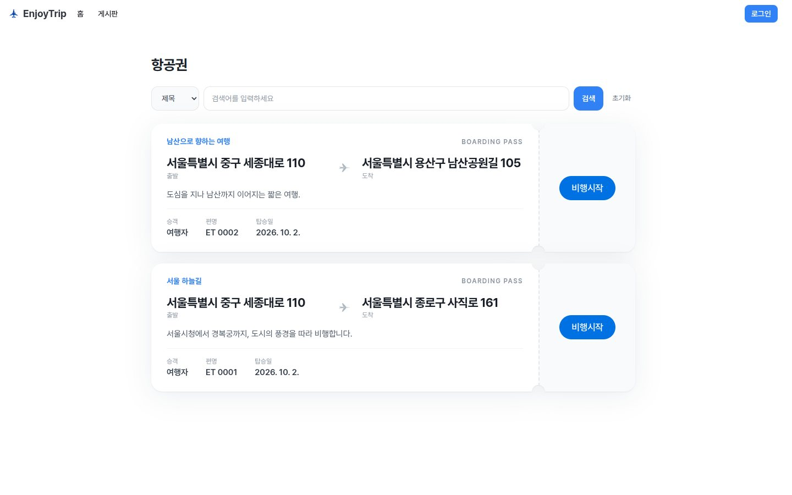
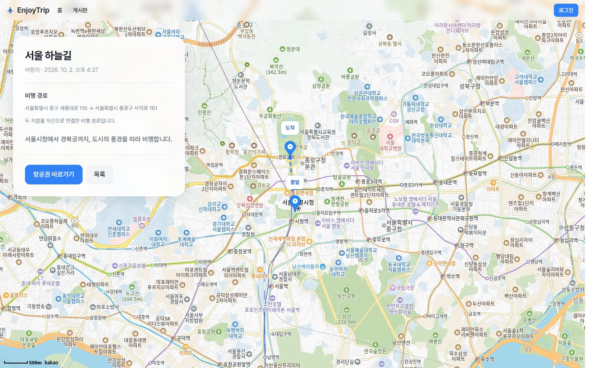

<div align="center">
  

  # EnjoyTrip

  **여행을 기록하고, 항공권을 만들고, 직접 비행하세요.**

  게시글에 입력한 출발지와 도착지를 따라 비행하며 주변의 관광지·음식점·숙소를 발견하는 웹 서비스

  `HTML5` · `CSS3` · `JavaScript` · `Node.js 24+` · `SQLite`

  [플레이 영상](#플레이-영상) · [서비스 화면](#서비스-화면) · [시작하기](#시작하기) · [조작 방법](#조작-방법)
</div>

---

## 플레이 영상

[](docs/media/flight-demo.webm)

**[▶ 플레이 영상 보기 (WebM)](docs/media/flight-demo.webm)** · 탑승 안내부터 카운트다운, 선회·가속, 주변 음식점 탐색까지 담았습니다.

## EnjoyTrip에서 할 수 있는 일

1. **여행 경로 기록** — 출발지와 도착지를 지정해 게시글을 작성하고, 지도에서 두 지점의 직선 경로를 확인합니다.
2. **항공권으로 출발** — 작성한 게시글이 항공권 카드가 됩니다. 카드를 선택하면 해당 경로의 조종석으로 이동합니다.
3. **직접 조종** — 키보드 또는 화면 버튼으로 기수를 움직이고 속도를 조절합니다. 위성 지도·계기판이 비행 위치에 맞춰 갱신됩니다.
4. **주변 둘러보기** — 현재 위치 반경 2km의 관광지·음식점·숙소를 공공데이터에서 조회해 레이더와 가까운 순 목록으로 표시합니다.

## 서비스 화면

### 비행 플레이

| 탑승 안내 | 비행 조종석 |
| --- | --- |
|  |  |
| 탑승 방식을 선택하고 조작 키를 확인한 뒤 출발합니다. | 출발·도착 경로 위에서 비행하고 지도·속도·방위를 실시간으로 확인합니다. |

| 주변 둘러보기 |
| --- |
|  |
| 현재 비행 위치의 관광·음식·숙소를 분류별로 보고, 거리와 기수 기준 방향을 확인합니다. |

### 주요 페이지

| 홈 | 여행 게시판 |
| --- | --- |
|  |  |
| 비행과 여행 기록으로 바로 이동합니다. | 여행 글을 제목·내용·출발지·도착지로 검색합니다. |

| 항공권 목록 | 게시글 상세 |
| --- | --- |
|  |  |
| 여행 글을 항공권으로 보고 비행을 시작합니다. | 여행 설명과 지도 경로를 함께 확인합니다. |

> 화면과 영상은 별도의 데모 데이터로 촬영했습니다. 지도와 주변 장소는 촬영 시점의 외부 API 응답을 사용합니다.

## 주요 기능

| 영역 | 기능 |
| --- | --- |
| 비행 경로 | 게시글 주소를 좌표로 변환하고 출발·도착 마커와 직선 경로 표시 |
| 비행 조종 | 3초 출발 카운트다운, 방향·추력 조작, 위치·속도·고도·방위 갱신, 일시정지 |
| 경로 상태 | 경로 구간에서 10km 이상 이탈 시 경고, 도착지 반경 100m에서 종료·계속 비행 선택 |
| 주변 탐색 | 한국관광공사 위치 기반 API로 반경 2km의 관광지·음식점·숙소 조회 및 필터·레이더 표시 |
| 여행 게시판 | 게시글 작성·수정·삭제, 검색·페이지 이동, 지도 경로와 항공권 연결 |
| 계정·운영 | 회원가입·로그인·마이페이지, 관리자 화면과 공지사항 |

## 조작 방법

1. 로그인 후 게시글에 **출발지와 도착지 주소**를 입력합니다.
2. `/flight`에서 해당 항공권의 **비행시작**을 누릅니다.
3. 혼자 또는 함께 탑승을 선택하고, 카운트다운 후 비행합니다.

| 입력 | 동작 |
| --- | --- |
| `A` / `←`, `D` / `→` | 왼쪽·오른쪽 선회 |
| `W`, `S` | 기수 내림·올림 |
| `↑`, `↓` | 가속·감속 |
| 화면의 핸들·페달 | 해당 키와 같은 조작 |

조작 안내를 열거나 다른 탭으로 이동하면 비행이 잠시 멈춥니다. 모바일에서는 화면 버튼을 길게 눌러 조종할 수 있습니다.

## 기술 구성

```text
frontend/                     HTML·CSS·JavaScript 화면과 지도·조종석 컴포넌트
backend/                      Node.js HTTP 서버, 인증·게시글·공지·주변 장소 API
backend/db/                   내장 SQLite 스키마와 마이그레이션
docs/API_ENDPOINTS.md         API 요청·응답 명세
tests/                        서버·DB·지도·비행 로직 테스트
```

브라우저는 같은 출처의 `/api`를 호출합니다. 지도와 주소 좌표 변환에는 Kakao Maps JavaScript SDK를 사용하고, 주변 장소는 서버가 [한국관광공사 국문 관광정보 서비스](https://www.data.go.kr/data/15101578/openapi.do)에서 조회합니다. 공공데이터 서비스 키는 브라우저로 전달하지 않습니다.

## 시작하기

### 1. 요구 사항

- Node.js **24 이상**
- [Kakao Maps JavaScript 키](https://developers.kakao.com/)
- [공공데이터포털 한국관광공사 국문 관광정보 서비스 키](https://www.data.go.kr/data/15101578/openapi.do)

외부 npm 패키지 설치 없이 실행합니다.

### 2. 로컬 환경변수

프로젝트 루트에 `.env.local`을 만듭니다.

```dotenv
HOST=127.0.0.1
PORT=3000
APP_ORIGIN=http://127.0.0.1:3000
DB_PATH=backend/data/enjoytrip.sqlite
COOKIE_SECURE=false
KAKAO_MAP_JAVASCRIPT_KEY=your_kakao_javascript_key
TOUR_API_SERVICE_KEY=your_data_go_kr_service_key
```

Kakao 개발자 콘솔에서 **카카오맵 사용 설정**을 켜고 실제 접속 주소를 웹 도메인에 등록하세요. 예를 들어 `http://localhost:3000`과 `http://127.0.0.1:3000`은 각각 등록해야 합니다. 주소 좌표 변환에 지도 SDK의 `services` 라이브러리를 사용합니다.

### 3. 실행 및 테스트

```bash
npm run dev
npm test
```

기본 접속 주소는 `http://127.0.0.1:3000`입니다. `npm run dev`는 `.env.local`, `npm start`는 `.env.production`을 읽습니다. 운영 환경에서는 HTTPS 주소와 `COOKIE_SECURE=true`가 필요합니다. DB는 첫 실행 시 생성되며 환경변수 파일과 DB 파일은 Git에 포함되지 않습니다.

## API 문서

요청·응답과 인증 규칙은 [API 명세](docs/API_ENDPOINTS.md)를 참고하세요. 프런트엔드는 같은 서버의 상대 경로를 사용합니다.
